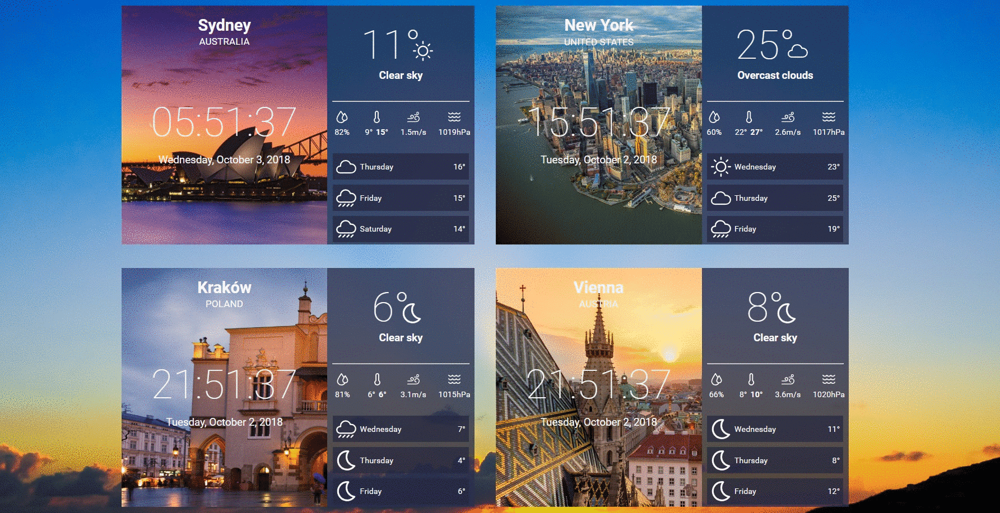

# Weatherin-clock

This application displays the current weather and time based on the given city, country and timezone.


Application was generated with create-react-app.

## Setup

To use this project, you need to get your own API_KEY from https://openweathermap.org/ and declare it in .env file.

```
API_KEY=yourkeyhere
```

### Installation

Probably you need Windows-Build-Tools.

> install this package first with npm

```
npm install --global windows-build-tools
```

> now you can install the project

```
npm install
```

> then run the application

```
npm start
```

The application will be automatically navigated to http://localhost:3000.

### Prettier & ESlint

You can format your code with Prettier and ESLint.

```
npm run format
npm run lint
```

## Built With

- [React](https://reactjs.org/) - JavaScript library
